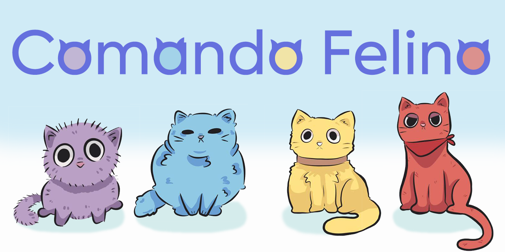

# Comando Felino
¡Bienvenidx al repositorio del proyecto Comando Felino!


¡Gatitos comandados por tu voz! :3

Basado en p5.js usando ml5.js y Teachable Machine como base para la I.A.  
Proyecto desarrollado por:  
- [Benjamin Rivas](https://github.com/benjaminrivasm)
- [Fernanda Navarrete](https://github.com/feff-y)
- [Gabriel Castillo](https://github.com/GabooDesign)  

## Acerca del Proyecto

Este proyecto se basa en un juego del género plataforma sin controles, sino que la voz de uno mismo, esto fue desarrollado en p5.js, ml5.js y Teachable Machine.  
La idea de este proyecto se basó en un juego plataformero estilo Mario Bros, pero con la diferenciación de que no se juega con un control físico, sino que la voz de uno mismo.  

¡Tenemos 4 personajes!  
🟡***Mikey***: El primer gatito, de color amarillo y es el gatito que mas te hace caso a tus instrucciones.  
🔴***Rafa***: Es un gatito que va a su ritmo, tus instrucciones serán al revés.  
🟣***Donnie***: Es un gatito miedoso, si le das muchas instrucciones, huirá de ti. (Por incluir)  
🔵***Leo***:Es un gatito gordito, es muy lento... (Por incluir)   

## Código del Proyecto

el código fuente que desarrollamos es

```javascript
// --- COMANDO FELINO ---
// Beta 1.0

// Variables principales del jugador y físicas
let player;
let secondPlayer = null; // Segundo jugador con controles invertidos
let gravity = 0.4;
let jumpForce = 5;
let jumping = false;
let obstacles = [];

let playerSpeed = 1.3;
let jumpSpeed = 1.3;

let zoomedMode = true;

// Coyote time
let coyoteTime = 500; // en milisegundos
let coyoteTimeCounter = 0;
let secondCoyoteTimeCounter = 0; // Coyote time para el segundo jugador

let mikeyIdle, mikeyJump, mikeyWalk1, mikeyWalk2;
let rafaIdle, rafaJump, rafaWalk1, rafaWalk2;

// Estado de segundo jugador
let secondPlayerActive = false;

// Estado de victoria
let juegoTerminado = false;

// Variable para mantener los resultados predichos por Teachable Machine
let predictedSound = "";

const modelJson= "https://teachablemachine.withgoogle.com/models/6tGPKVwuCH/";

function preload() {
  // Cargar el modelo de clasificacion de sonido
  classifier = ml5.soundClassifier(modelJson);

  mikeyIdle = loadImage("sprites/mikeyIdle.png");
  mikeyJump = loadImage("sprites/mikeyJump.png");
  mikeyWalk1 = loadImage("sprites/mikeyWalk1.png");
  mikeyWalk2 = loadImage("sprites/mikeyWalk2.png");
  
  rafaIdle = loadImage("sprites/rafaIdle.png");
  rafaJump = loadImage("sprites/rafaJump.png");
  rafaWalk1 = loadImage("sprites/rafaWalk1.png");
  rafaWalk2 = loadImage("sprites/rafaWalk2.png");
}

function setup() {
  createCanvas(600, 400);
  iniciarPlayer(); // Inicializa la posición y estado del jugador
  iniciarObstacles(); // Crea los obstáculos del escenario

  classifier.classifyStart(gotResult);
}

function draw() {
  background(220);

  if (!juegoTerminado) {
    playerInput(); // Lee las teclas presionadas
    physics(); // Aplica gravedad y movimiento
    collisions(); // Revisa colisiones con obstáculos
  }

  // Si player llega a la meta, se congela y aparece un nuevo jugador
  if (player.x > 480 && player.x < 510 && !secondPlayerActive) {
    player.vx = 0;
    player.vy = 0;
    iniciarSecondPlayer();
  }

  // Si segundo jugador llega a la meta, se congela y termina el juego
  if (secondPlayerActive && !juegoTerminado &&
      secondPlayer.x > 510 && secondPlayer.x < 530) {
    secondPlayer.vx = 0;
    secondPlayer.vy = 0;
    juegoTerminado = true;
  }

  // Modo de zoom centrado en el jugador
  if (zoomedMode) {
    push();
    translate(width / 2, height / 2);
    scale(3.5);

    // Sigue al jugador activo
    if (secondPlayerActive) {
      translate(-secondPlayer.x, -secondPlayer.y);
    } else {
      translate(-player.x, -player.y);
    }

    drawScene();
    pop();
  } else {
    drawScene();
  }

  // Actualiza el coyote time para ambos jugadores
  if (!player.onGround) {
    coyoteTimeCounter -= deltaTime;
  } else {
    coyoteTimeCounter = coyoteTime;
  }

  if (secondPlayerActive) {
    if (!secondPlayer.onGround) {
      secondCoyoteTimeCounter -= deltaTime;
    } else {
      secondCoyoteTimeCounter = coyoteTime;
    }
  }

  // Muestra mensaje de victoria
  if (juegoTerminado) {
    fill(0);
    textAlign(CENTER, CENTER);
    textSize(40);
    text("¡GANASTE!", width / 2, height / 2);
  }
}

function iniciarObstacles() {
  obstacles = [
    // Suelo principal
    { x: 0, y: 300, w: 600, h: 100 },
    // Escalera
    { x: 150, y: 280, w: 120, h: 30 },
    { x: 170, y: 260, w: 80, h: 30 },
    { x: 190, y: 240, w: 40, h: 30 },
    // Plataformas
    { x: 270, y: 240, w: 60, h: 20 },
    { x: 320, y: 255, w: 50, h: 5 },
    { x: 360, y: 220, w: 60, h: 40 },
    // Plataforma final
    { x: 360, y: 240, w: 210, h: 70 },
    { x: 466, y: 237, w: 60, h: 3 },
    // Límites laterales y techo
    { x: -100, y: 0, w: 150, h: 400 },
    { x: 50, y: 0, w: 600, h: 170 },
    { x: 550, y: 150, w: 150, h: 250 },
  ];
}

function playerInput() {
  // Velocidad del primer jugador (se ajusta si está en el aire)
  let speed = jumping ? jumpSpeed : playerSpeed;

  if (secondPlayerActive) {
    // Velocidad del segundo jugador según si está en el aire
    let spd = jumping ? jumpSpeed : playerSpeed;

    if (juegoTerminado) return;

    // Controles invertidos
    if (predictedSound == "duerme"  && secondCoyoteTimeCounter > 0) {
      secondPlayer.vy = -jumpForce;
      jumping = true;
      secondCoyoteTimeCounter = 0;
    }
    if (predictedSound == "derecha") {
      secondPlayer.vx = -spd;
    } else if (predictedSound == "izquierda") {
      secondPlayer.vx = spd;
    } else if (predictedSound == "salta") {
      secondPlayer.vx = 0;
    }
  } else {
    if (predictedSound == "salta" && coyoteTimeCounter > 0 && !jumping) {
      player.vy = -jumpForce;
      jumping = true;
      coyoteTimeCounter = 0;
    }
    if (predictedSound == "derecha") {
      player.vx = speed;
    } else if (predictedSound == "izquierda") {
      player.vx = -speed;
    } else if (predictedSound == "duerme") {
      player.vx = 0;
    }
  }
}

function physics() {
  // Aplica gravedad al jugador original
  player.vy += gravity;
  player.x += player.vx;
  player.y += player.vy;
  player.onGround = false;

  // Aplica gravedad al segundo jugador si está activo
  if (secondPlayerActive && !juegoTerminado) {
    secondPlayer.vy += gravity;
    secondPlayer.x += secondPlayer.vx;
    secondPlayer.y += secondPlayer.vy;
    secondPlayer.onGround = false;
  }
}

function collisions() {
  for (let obs of obstacles) {
    let px = player.x - player.w / 2;
    let py = player.y - player.h / 2;
    let pw = player.w;
    let ph = player.h;

    // Detecta si hay colisión con obstáculos (jugador original)
    if (
      px < obs.x + obs.w &&
      px + pw > obs.x &&
      py < obs.y + obs.h &&
      py + ph > obs.y
    ) {
      let prevBottom = player.y - player.vy + player.h / 2;
      let prevTop = player.y - player.vy - player.h / 2;

      if (prevBottom <= obs.y) {
        // Colisión desde arriba (aterrizar)
        player.y = obs.y - player.h / 2;
        player.vy = 0;
        player.onGround = true;
        jumping = false;
      } else if (prevTop >= obs.y + obs.h) {
        // Colisión desde abajo
        player.y = obs.y + obs.h + player.h / 2;
        player.vy = 0;
      } else {
        // Colisión lateral
        if (player.vx > 0) {
          player.x = obs.x - player.w / 2;
        } else if (player.vx < 0) {
          player.x = obs.x + obs.w + player.w / 2;
        }
      }
    }

    // Colisiones del segundo jugador
    if (secondPlayerActive) {
      let spx = secondPlayer.x - secondPlayer.w / 2;
      let spy = secondPlayer.y - secondPlayer.h / 2;
      let spw = secondPlayer.w;
      let sph = secondPlayer.h;

      if (
        spx < obs.x + obs.w &&
        spx + spw > obs.x &&
        spy < obs.y + obs.h &&
        spy + sph > obs.y
      ) {
        let prevBottom = secondPlayer.y - secondPlayer.vy + secondPlayer.h / 2;
        let prevTop = secondPlayer.y - secondPlayer.vy - secondPlayer.h / 2;

        if (prevBottom <= obs.y) {
          secondPlayer.y = obs.y - secondPlayer.h / 2;
          secondPlayer.vy = 0;
          secondPlayer.onGround = true;
        } else if (prevTop >= obs.y + obs.h) {
          secondPlayer.y = obs.y + obs.h + secondPlayer.h / 2;
          secondPlayer.vy = 0;
        } else {
          if (secondPlayer.vx > 0) {
            secondPlayer.x = obs.x - secondPlayer.w / 2;
          } else if (secondPlayer.vx < 0) {
            secondPlayer.x = obs.x + obs.w + secondPlayer.w / 2;
          }
        }
      }
    }
  }
}

// ----- RENDER GENERAL -----
function drawScene() {
  drawBackground();
  drawObstacles();
  drawPlayer();
  drawGoal();
}

// ----- FONDO -----
function drawBackground() {
  background(135, 206, 235);

  fill(255, 255, 255, 150);
  noStroke();

  rect(70, 210, 60, 20, 10);
  rect(160, 185, 80, 30, 10);
  rect(280, 190, 50, 15, 10);
  rect(360, 205, 60, 10, 10);
  rect(450, 190, 70, 25, 10);
}

// ----- OBSTÁCULOS -----
function drawObstacles() {
  fill(50);
  noStroke();
  for (let obs of obstacles) {
    rect(obs.x, obs.y, obs.w, obs.h);
  }
}

// ----- META -----
function drawGoal() {
  fill(100, 200, 100);
  stroke(0);
  strokeWeight(0.8);
  rect(466, 237, 60, 3);
}

// ----- JUGADOR -----
function drawPlayer() {
  // ----- PRIMER JUGADOR -----
  let sprite;

  if (!player.onGround) {
    sprite = mikeyJump;
  } else if (player.vx !== 0) {
    player.animTimer += deltaTime;
    if (player.animTimer > 300) {
      player.currentFrame = (player.currentFrame + 1) % 2;
      player.animTimer = 0;
    }
    sprite = player.currentFrame === 0 ? mikeyWalk1 : mikeyWalk2;
  } else {
    sprite = mikeyIdle;
    player.animTimer = 0;
    player.currentFrame = 0;
  }

  push();
  translate(player.x, player.y);
  let scaleW = 20 / sprite.width;
  let scaleH = 20 / sprite.height;
  scale(player.vx < 0 ? -scaleW : scaleW, scaleH);
  imageMode(CENTER);
  image(sprite, 0, 0);
  pop();

  // ----- SEGUNDO JUGADOR (invertido) -----
  if (secondPlayerActive) {
    let sprite2;

    if (!secondPlayer.onGround) {
      sprite2 = rafaJump;
    } else if (secondPlayer.vx !== 0 && !juegoTerminado) {
      secondPlayer.animTimer += deltaTime;
      if (secondPlayer.animTimer > 300) {
        secondPlayer.currentFrame = (secondPlayer.currentFrame + 1) % 2;
        secondPlayer.animTimer = 0;
      }
      sprite2 = secondPlayer.currentFrame === 0 ? rafaWalk1 : rafaWalk2;
    } else {
      sprite2 = rafaIdle;
      secondPlayer.animTimer = 0;
      secondPlayer.currentFrame = 0;
    }

    push();
    translate(secondPlayer.x, secondPlayer.y);
    let scaleW2 = 20 / sprite2.width;
    let scaleH2 = 20 / sprite2.height;
    scale(secondPlayer.vx < 0 ? -scaleW2 : scaleW2, scaleH2);
    imageMode(CENTER);
    image(sprite2, 0, 0);
    pop();
  }
}

// Tecla "f" activa o desactiva el modo de zoom
function keyPressed() {
  if (key === "f" || key === "F") {
    zoomedMode = !zoomedMode;
  }
}

// Funcion para correr cuando tienes algun error o los resultados
function gotResult(results) {
  // Los resultados se guardan por nivel de confianza de IA
  console.log(results);
  // Guardar la primera label
  predictedSound = results[0].label;
}

// ----- NUEVO JUGADOR -----

function iniciarPlayer() {
  player = {
    x: 100,
    y: 290,
    w: 20,
    h: 14,
    vx: 0,
    vy: 0,
    onGround: false,
    facing: "right",
    animTimer: 0,
    currentFrame: 0,
  };
}

// Crea un nuevo jugador con controles invertidos

function iniciarSecondPlayer() {
  secondPlayer = {
    x: 100,
    y: 290,
    w: 20,
    h: 14,
    vx: 0,
    vy: 0,
    onGround: false,
    facing: "right",
    animTimer: 0,
    currentFrame: 0,
  };
  secondCoyoteTimeCounter = coyoteTime;
  secondPlayerActive = true;
}

```

## Enlace del Proyecto

Lo hicimos en editor de [p5.js](https://editor.p5js.org/benjaminrivasm/sketches/HDTRxJY56)

## Documentación multimedia

Nos ha pasado varias veces al momento de realizar el "testing" de que el audio no era reconocido por Teachable Machine. Nuestra teoria es que las variables que nos afectaban eran el ruido de fondo y que la cantidad de samples de audio, pueden tener variaciones en la entonación. Es por esto que nosotros hicimos muchos samples de dos voces, para intentar hacerlo lo más universal posible.    

## Bibliografía)

Inspiración de concepto: [Cat Catcher en Itch.io]([http://markdown.github.io](https://krabcode.itch.io/cat-catcher))
Usamos la biblioteca p5.js v1.11.5., la biblioteca de sound.p5, la biblioteca ml5.js y Teachable Machine by Google


## Conclusiones

